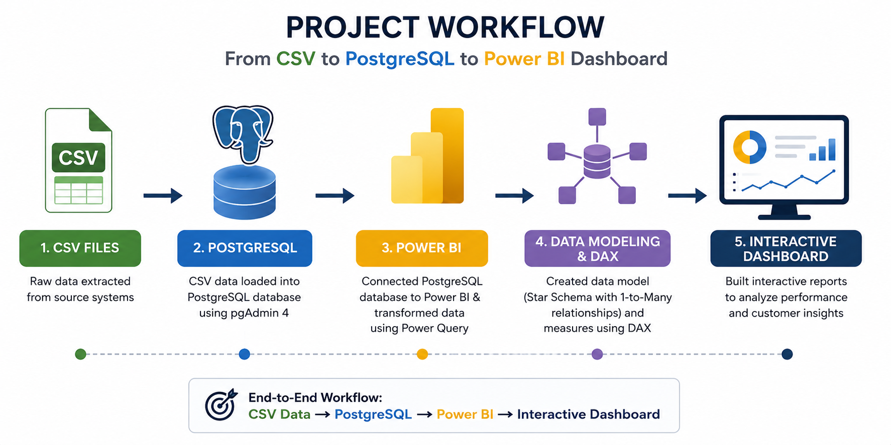
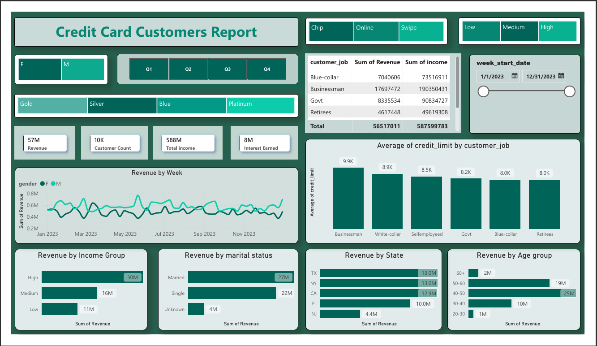
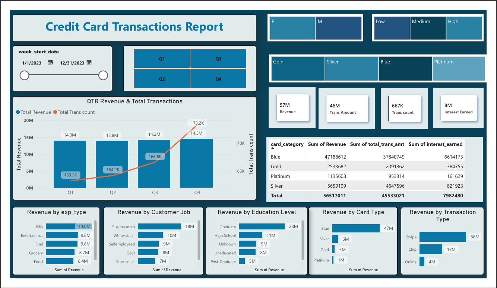

# 📊 Credit Card Financial Dashboard

A comprehensive **Credit Card Financial Dashboard** developed using **Excel, PostgreSQL, and Power BI** to provide real-time insights into key business metrics and financial trends. This project demonstrates an end-to-end Business Intelligence workflow, enabling stakeholders to monitor business performance, analyze customer behavior, and make data-driven decisions through interactive dashboards.

---

# 🚀 Project Overview

This project showcases the complete Business Intelligence lifecycle, from raw data storage to interactive reporting.

The workflow begins with Excel datasets, which are imported into PostgreSQL for structured storage. The database is then connected to Power BI, where data is cleaned and transformed using **Power Query**, modeled using a **Star Schema**, and analyzed through **DAX measures** to build insightful and interactive dashboards.

---

# 🛠️ Tools & Technologies

* **Microsoft Excel** – Data Source
* **PostgreSQL** – Database Management
* **Power BI Desktop**

  * Power Query
  * Data Modeling (Star Schema)
  * DAX
  * Interactive Dashboards
* **Git & GitHub** – Version Control

---

# 🔄 Project Workflow

The following diagram illustrates the complete workflow used in this project.

<p align="center">
  
</p>

---

# 🎯 Project Objectives

* Import and manage credit card data using PostgreSQL.
* Connect PostgreSQL with Power BI.
* Clean and transform data using Power Query.
* Design an optimized Star Schema data model.
* Create reusable DAX measures and KPIs.
* Develop interactive dashboards for business analysis.
* Deliver meaningful insights for informed decision-making.

---

# ⚙️ End-to-End Workflow

1. Data Collection (Excel)
2. Database Creation (PostgreSQL)
3. Data Import into PostgreSQL
4. Connect PostgreSQL to Power BI
5. Data Cleaning & Transformation (Power Query)
6. Data Modeling (Star Schema)
7. DAX Measure Development
8. Interactive Dashboard Creation

---

# 🧹 Data Preparation

Data preparation was performed using **Power Query** in Power BI.

The following transformations were applied:

* Data type corrections
* Column formatting
* Data validation
* Data transformation
* Relationship preparation
* Optimized tables for reporting

---

# 🗄️ Database

The source data is stored in **PostgreSQL**, providing a structured and scalable database for reporting. Power BI is connected directly to PostgreSQL, ensuring efficient data retrieval and analysis.

---

# 📐 Data Modeling

A **Star Schema** was implemented to optimize report performance and simplify data analysis.

The model consists of fact and dimension tables connected through well-defined relationships, enabling efficient filtering and accurate DAX calculations.

---

# 📈 Dashboard Preview

## 👥 Customer Report

This report provides insights into customer demographics and credit card usage, including:

* Customer Count
* Income Group Analysis
* Age Group Distribution
* Gender Analysis
* Education Level
* Marital Status
* Card Category
* Customer Acquisition Trends
* Revenue by Customer Segment

<p align="center">
  
</p>

---

## 💳 Transaction Report

This report focuses on financial performance and transaction analysis, including:

* Total Revenue
* Total Interest Earned
* Total Transaction Amount
* Total Transactions
* Quarterly Performance
* Revenue Trends
* Card Category Performance
* Expenditure Type Analysis
* State-wise Revenue Analysis
* Key Performance Indicators (KPIs)

<p align="center">
  
</p>

---

# ✨ Key Features

* Interactive KPI Cards
* Dynamic Filters & Slicers
* Customer Segmentation
* Revenue & Transaction Analysis
* Card Category Comparison
* Quarterly Performance Tracking
* State-wise Financial Analysis
* Responsive Dashboard Design

---

# 💼 Skills Demonstrated

* Microsoft Excel
* PostgreSQL
* SQL
* Power BI
* Power Query
* Data Cleaning
* Data Transformation
* Star Schema Data Modeling
* DAX
* Dashboard Design
* Business Intelligence
* Data Visualization

---

# 📁 Repository Structure

```text
Credit-Card-Financial-Dashboard
│
├── Data
│   └── Credit_Card_Data.xlsx
├── SQL
│   ├── Database.sql
│   └── Queries.sql
├── PowerBI
│   └── Credit_Card_Financial_Dashboard.pbix
├── Images
│   ├── Workflow.png
│   ├── Customer_Report.png
│   └── Transaction_Report.png
├── README.md
└── LICENSE
```

---

# 🚀 Future Improvements

* Real-time database integration
* Automated data refresh
* Predictive analytics
* Customer churn analysis
* Revenue forecasting
* Executive KPI monitoring

---

# ⚠️ Disclaimer

This project was created for educational and portfolio purposes only. The dataset used is intended solely for demonstrating Business Intelligence, SQL, and Power BI skills and does not contain confidential financial information.

---

# 👨‍💻 Author

**Ammad Arshad**

**Data Analyst / BI Developer**

Passionate about Business Intelligence, SQL, PostgreSQL, Power BI, Data Modeling, and Dashboard Development.
